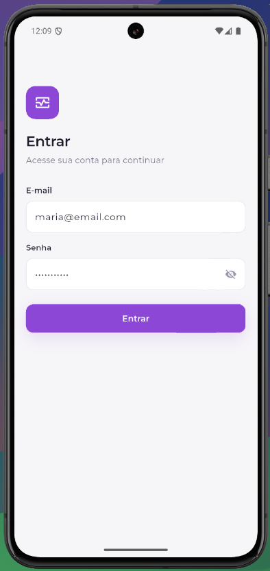
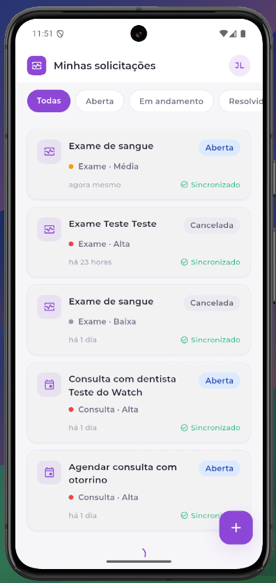
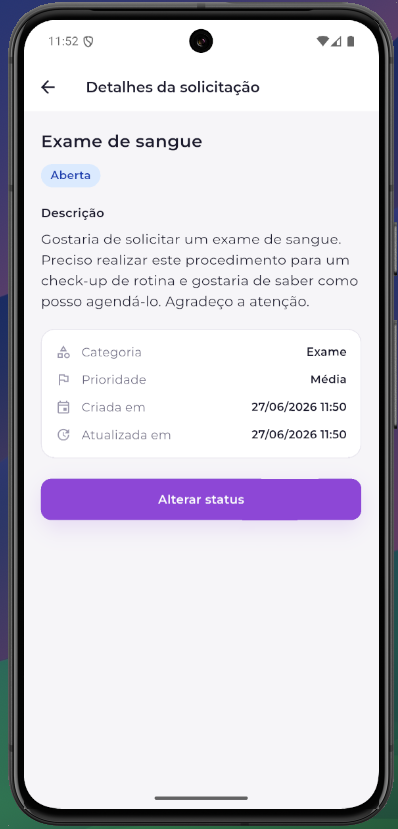
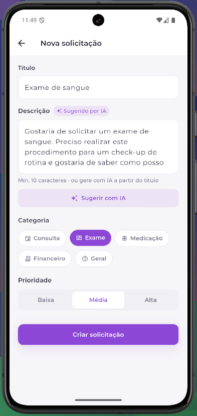
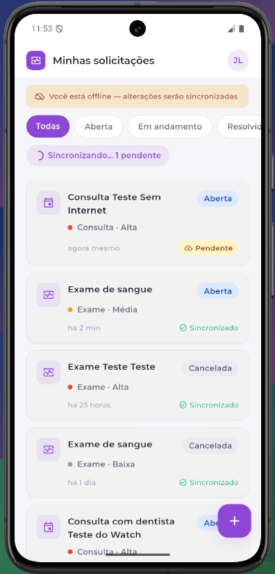
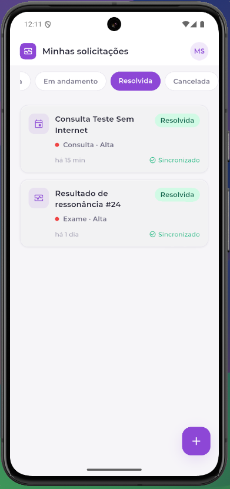
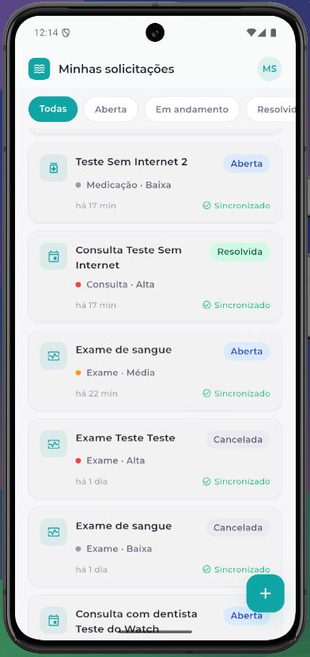

# App de acompanhamento de solicitações

App mobile de acompanhamento de solicitações, construído em **Flutter** para o teste técnico de Desenvolvedor Mobile Sênior.

O app permite: autenticar(api local), listar solicitações com filtro e paginação, ver detalhes, alterar status e criar novas solicitações — com **modo offline**, com uma fila local de sincronização que processa as ações pendentes automaticamente quando a internet volta.

Adicionalmente, inclui ainda **sugestão de descrição via IA (Gemini)** e suporte a **whitelabel** (duas marcas configuradas).

---

## Demonstração

> As imagens/GIFs ficam em `docs/screenshots/`.

| Login | Lista + filtro | Detalhe | Criar (IA) | Offline / Sync |
|-------|----------------|---------|------------|----------------|
|  |  |  |  |  |

| Brand A — Vitia Saúde | Brand B — Onda Saúde |
|-----------------------|----------------------|
|  |  |

**Credenciais de demonstração:** `maria@email.com` / `password123`

- **Drive:** [Evidência Fluxo Offline/Sync](https://drive.google.com/drive/folders/1jWqX1kvE3fPY352E-yQTDKv4jRQU90Of?usp=drive_link)

---

## Design

- **Figma:** [Protótipo do App — UI Kit](https://www.figma.com/design/a7isMZ1rSY6bjL0k4KpFgV/App-Acompanhamento-de-Solicita%C3%A7%C3%B5es?node-id=0-1&t=AGImIn2rmeGqFzth-1)
- O design system foi prototipado no **Claude Design**, a partir de um arquivo de **design tokens** (`docs/design-brief.md`), e então exportado para o Figma.

---

## Como executar

**Pré-requisitos:** Flutter 3.44.3 estável, Node.js 18+ (para o mock), um emulador/dispositivo.

#### Links úteis:
- Flutter: https://docs.flutter.dev/install
- Node: https://nodejs.org/en/download
- Android Studio: https://developer.android.com/studio?hl=pt-br
- Emulador Android: https://developer.android.com/studio/run/managing-avds?hl=pt-br

Obs.: Nesse projeto, estou utilizando a versão (3.44.3) do Flutter, Dart (3.12.2) e Android Studio Iguana | 2023.2.1 Patch 2

```bash
# 1. Dependências
flutter pub get

# 2. Geração de código (Drift)
dart run build_runner build --delete-conflicting-outputs

# 3. Variáveis de ambiente (IA opcional)
cp .env.example .env        # preencha GEMINI_API_KEY (sem chave, a sugestão de IA fica desativada)
```

**Importante:** Por não ser uma boa prática, não subi o .env com GEMINI_API_KEY. Para usar a funcionalidade de *Sugerir Descrição com IA*, é simples: Basta ir no link https://aistudio.google.com/api-keys e criar uma chave e depois colar no arquivo .env e já funcionará.

**Subir a API mock** (em outro terminal):
```bash
cd api-mock
npm install
npm run mock                # http://localhost:3000
# Outros comandos que podem ser úteis
npm run mock:watch          # Para testar o pull-to-refresh (alterando o db.json manualmente)
npm run mock:slow           # Rodar com mairo latência (ajuda a visualizar paginação)
```

**Rodar o app:**
```bash
# Marca A (Vitia Saúde)
flutter run -t lib/main_brand_a.dart

# Marca B (Onda Saúde — whitelabel)
flutter run -t lib/main_brand_b.dart

# Outra alternativa
Usar o Run And Debug do VS Code. Já subi o launch.json com as duas marcas
```

**Rede por plataforma:** emulador Android usa `http://10.0.2.2:3000`; simulador iOS / web / desktop usam `http://localhost:3000`.

---

## Decisões de Design de Software
No contexto geral, optei por construir o app unindo duas coisas: Tecnologias que possuo domínio e experiência + Uso crítico e estratégico de IA.
- **Drift.** Biblioteca de persistência de dados reativa. Sempre observa *streams* locais; a rede apenas preenche o cache. Isso torna o app instantâneo e consistente, online ou offline.
- **Escritas otimistas + fila de sync.** Criar/alterar grava local (`syncStatus = pending`) e enfileira a operação; a UI atualiza na hora. Um `SyncService` processa a fila **FIFO**, com **backoff exponencial** e parada no primeiro erro (preserva a ordem das operações).
- **Reconciliação `localId` <-> `remoteId`.** O cliente gera um `localId` (UUID) estável; o `remoteId` chega após o sync do `create`. Isso garante que um `update` enfileirado antes do `create` sincronizar seja resolvido corretamente.
- **Pull-to-refresh "push-then-pull".** Drena a fila pendente **antes** de buscar a página 1, evitando sobrescrever dados locais ainda não enviados.
- **Paginação por página** (`_page`/`_limit`) com `X-Total-Count` para saber quando parar.
- **Whitelabel via `BrandConfig` + flavors.** A marca injeta cores e identidade; os componentes leem `Theme.of(context).colorScheme` (nunca cores fixas), então trocar de marca não altera nenhum layout.
- **`AuthBloc` único** provido acima do `MaterialApp`, compartilhado por todas as rotas.
- **Token em armazenamento seguro** (`flutter_secure_storage`) com proteção de rotas privadas via `AuthGate`.


## Arquitetura

**Clean Architecture organizada por feature.** Cada feature isola três camadas, conectadas por abstrações (interfaces), de modo que a camada de domínio é Dart puro, sem dependência de framework.

```
lib/
├── core/                 # Compartilhado entre features
│   ├── constants/        # AppConstants, ApiConstants
│   ├── db/               # Drift: tables, daos, AppDatabase
│   ├── design_system/    # Tokens, theme, BrandConfig, components
│   ├── di/               # get_it (injection.dart)
│   ├── enums/            # RequestStatus/Category/Priority, SyncStatus
│   ├── error/            # Failure hierarchy, exceptions
│   ├── network/          # DioClient, AuthInterceptor, GeminiClient
│   ├── services/         # ConnectivityService, SyncService
│   ├── storage/          # SecureStorageService
│   └── usecases/         # UseCase / StreamUseCase base
└── features/
    ├── auth/             # data · domain · presentation
    └── requests/         # data · domain · presentation
```

| Camada | Responsabilidade | Conteúdo |
|--------|------------------|----------|
| **domain** | Regras de negócio | Entities, Repositories (abstratos), Use Cases (`Either<Failure, T>`) |
| **data** | I/O | Models (JSON ↔ entity), DataSources (Drift/Dio/SecureStorage), RepositoryImpl |
| **presentation** | UI + estado | BLoCs (events/states), Screens, Widgets |

**Gerenciamento de estado — BLoC:** É um Gerenciador de Estado que possuo experiência prévia com modo offline/sync, o teste é centrado em fluxos assíncronos (streams do Drift, conectividade, fila de sync). BLoC modela isso explicitamente com eventos → estados imutáveis, separa lógica da UI, é altamente testável (`bloc_test`) e escala bem em uma base por feature. O ponto negativo é a sua verbosidade.

---

## Testes

Cobertura focada na **camada de lógica**: use cases, repositories, datasources, services e BLoCs usando o padrão AAA (Arrange, Act, Assert).

```bash
# Para rodar os testes
flutter test
```

Destaques:
- **SyncService** — fila FIFO
- **Fluxo crítico offline → sync** (`sync_flow_integration_test.dart`): cria offline, reconecta, processa fila, reconcilia.
- **BLoCs** com `bloc_test`.

---

## API Mock

`json-server` + middleware customizado (`mock/server.js`) com **JWT real** (`jsonwebtoken`):

- `POST /login` → `{ token, user }` (usuário seedado: `maria@email.com` / `password123`).
- `GET /requests?_page=1&_limit=20&status=open` — paginado + filtrado, retorna `X-Total-Count`.
- `POST /requests`, `PATCH /requests/:id` — protegidos por `Authorization: Bearer <token>`.
- **Latência** configurável (`LATENCY_MS`, padrão 600ms) e **falhas** simuladas (`npm run mock:fail` ou header `x-mock-fail: true`) para demonstrar o retry da fila de sync.

---

## Uso de IA

Ferramenta: **Claude (Anthropic)** — modelos **Opus 4.8** e **Sonnet 4.6**. Como foi utilizada:

- **Planejamento:** A partir das minhas decisões de arquitetura e stack, um plano dividido por fases para construir o app.
- **Design system:** A partir de um Prompt especificado, geração do arquivo de **design tokens** (`docs/design-brief.md`) e prototipagem no **Claude Design**, depois exportado para o Figma.
- **Serialização:** Geração dos métodos de *serialization/deserialization* (`toMap`/`fromMap`, models <-> entities).
- **Mock API:** Criação dos dados de seed (`db.json`) extraído das Entidades.
- **Documentação:** Ajudou-me a estruturar esse README.

---

## Pontos que faria diferente com mais tempo
Algumas coisas eu faria diferente e outras eu adicionaria.
- **API real** no lugar do mock. Seria um próximo passo natural.
- **Testes:** Geração de testes automatizados E2E usando Playwright e integrando o seu MCP/Skill.
- **Internacionalização** (inglês e espanhol). O ideal seria fazer começo, mas poderia tomar o tempo de outras coisas de maior prioridade.
- **CI/CD** com pipeline de build/test e **SonarQube** para cobertura e qualidade.
- **Observabilidade** com **Sentry** (erros e performance).
- **Firebase** para **Crashlytics** e analytics/tracking.
- **Aumentaria a cobertura de testes,** cobrindo os fluxos críticos de UI e o ciclo offline → sync ponta a ponta.
- **Flavors nativos** completos (Android + schemes iOS) para habilitar `--flavor` e builds por marca lado a lado. (Esse comecei a fazer pensando no Whitelabel)
- **Novas features com Geração de código:** Com design de software definido e features já construídas, a integração de Agentes para apoio de novas features com **Spec Driven Development(SDD) e Harness**. 

---
